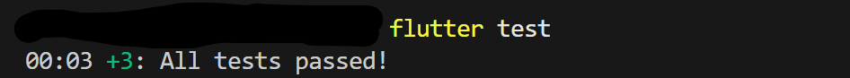

# **Testing in Flutter – Todo App**

This section explains how testing is structured in this Flutter project and how to run different types of tests, including **Unit Tests**, **Widget Tests**, and **Integration Tests**.

---

## **1️⃣ Folder Structure for Tests**

```
test/
├── todo_bloc_test.dart         # Unit tests for Bloc logic
├── todo_page_test.dart         # Widget tests for UI rendering
└── mocks/                      # Generated mocks for null-safe testing
    └── get_todos_mocks.mocks.dart

integration_test/
└── todo_integration_test.dart  # End-to-end integration tests
```

* **Unit Tests**: Test business logic in isolation (Bloc, UseCases, Repositories).
* **Widget Tests**: Test UI components and their interaction with Blocs.
* **Integration Tests**: Test the app end-to-end, including UI and API calls.

---

## **2️⃣ Packages Required**

Add the following to `pubspec.yaml`:

```yaml
dev_dependencies:
  flutter_test:
    sdk: flutter
  bloc_test: ^9.1.0
  mockito: ^5.5.0
  build_runner: ^2.5.0
  integration_test:
    sdk: flutter
```

* `bloc_test` → testing Blocs and state transitions
* `mockito` → mocking dependencies
* `build_runner` → generates null-safe mocks
* `integration_test` → Flutter’s official end-to-end testing package

---

## **3️⃣ Generating Mocks**

1. Create a file for mocks:

`test/mocks/get_todos_mocks.dart`

```dart
import 'package:mockito/annotations.dart';
import 'package:example_proj/src/features/todos/domain/usecases/get_todos.dart';

@GenerateMocks([GetTodos])
void main() {}
```

2. Run build\_runner:

```bash
flutter pub run build_runner build --delete-conflicting-outputs
```

* This generates `get_todos_mocks.mocks.dart` in the same folder.
* Generated mocks are **null-safe** and compatible with `Future<Either<Failure, List<Todo>>>`.

---

## **4️⃣ Unit Tests**

* **Purpose:** Test Bloc or UseCase logic in isolation.
* **Example:** `todo_bloc_test.dart`

```bash
flutter test test/todo_bloc_test.dart
```

**Key Points:**

* Use `blocTest` to test state transitions.
* Mock dependencies (like `GetTodos`) using generated mocks.
* Verify states: `TodoInitial → TodoLoading → TodoLoaded/TodoError`.

---

## **5️⃣ Widget Tests**

* **Purpose:** Test UI rendering, interaction, and Bloc integration.
* **Example:** `todo_page_test.dart`

```bash
flutter test test/todo_page_test.dart
```

**Key Points:**

* Wrap widgets in `MaterialApp` and `BlocProvider`.
* Stub dependencies using generated mocks.
* Example assertions: FloatingActionButton exists, list displays todos, error messages shown.

---

## **6️⃣ Integration Tests**

* **Purpose:** Test the full app end-to-end, simulating real user behavior.
* **Example:** `integration_test/todo_integration_test.dart`

```bash
flutter test integration_test/todo_integration_test.dart
```

Or using `flutter drive`:

```bash
flutter drive \
  --driver=integration_test/driver.dart \
  --target=integration_test/todo_integration_test.dart
```

**Key Points:**

* Uses the real API (DummyJSON or other endpoints).
* Tests include loading data, user interactions, and verifying UI updates.
* Slower than unit/widget tests, so usually run on nightly/CI pipelines.

---

## **7️⃣ Running All Tests**

Run **unit + widget tests**:

```bash
flutter test
```


Run **integration tests** separately:

```bash
flutter test integration_test/
```

> **Tip:** In CI/CD pipelines, run unit/widget tests on each commit, integration tests nightly or before release.

---

## **8️⃣ Testing Best Practices in This Project**

1. **Use Mocks for Unit/Widget tests**

   * Do **not call the real API**; stub `GetTodos.execute()`.

2. **Separate Unit, Widget, and Integration Tests**

   * Unit: Logic only
   * Widget: UI + Bloc
   * Integration: Full app end-to-end

3. **Use BlocTest for async state testing**

   * Avoid manually testing `emit` and `await` loops.

4. **Keep Integration Tests Minimal**

   * Test **critical user flows**: fetch todos, mark complete, handle errors.

5. **Use Code Generation for Null-Safe Mocks**

   * Required in null-safe Flutter/Dart.

---

This documentation ensures that **developers can quickly understand and run tests**, and maintain a **stable CI/CD pipeline**.

